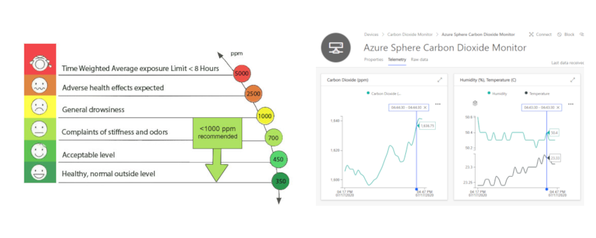
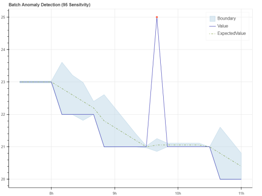
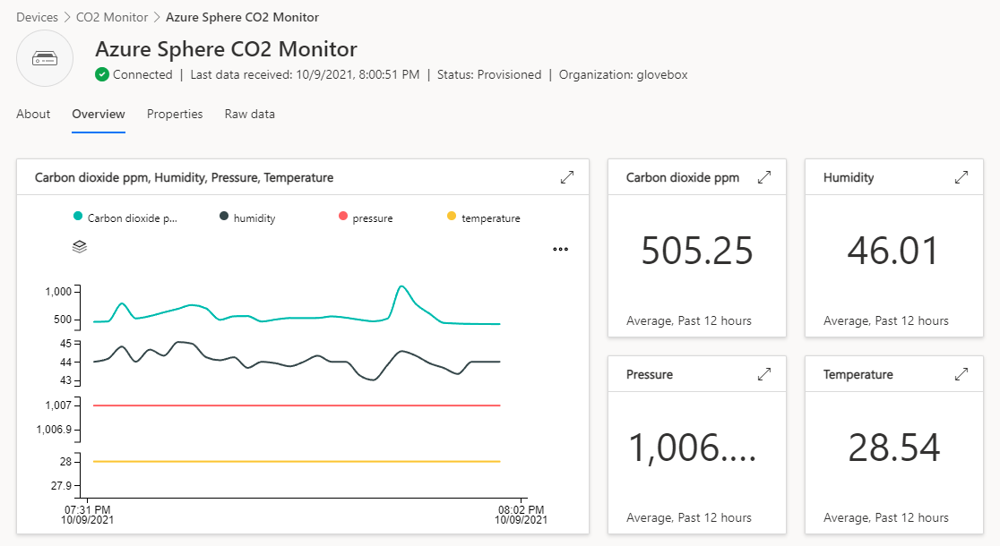
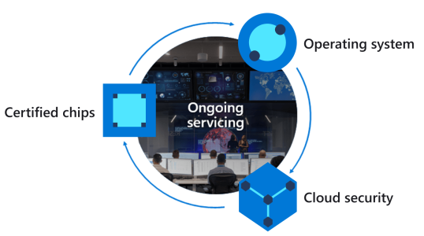
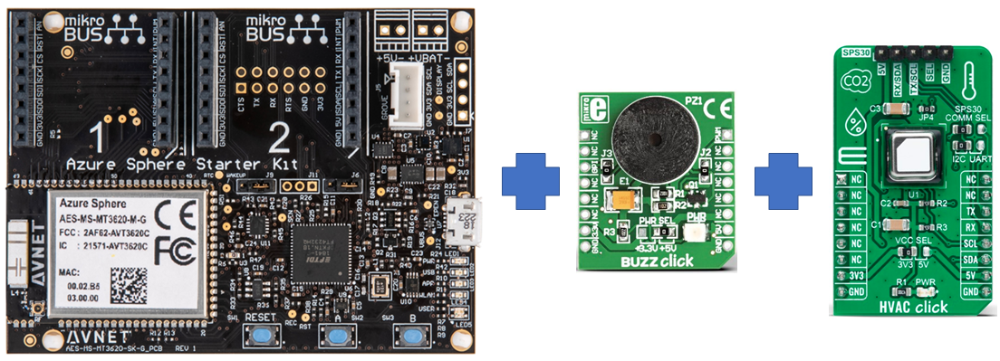
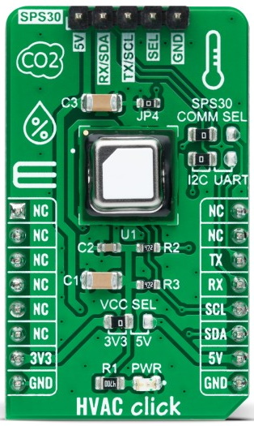
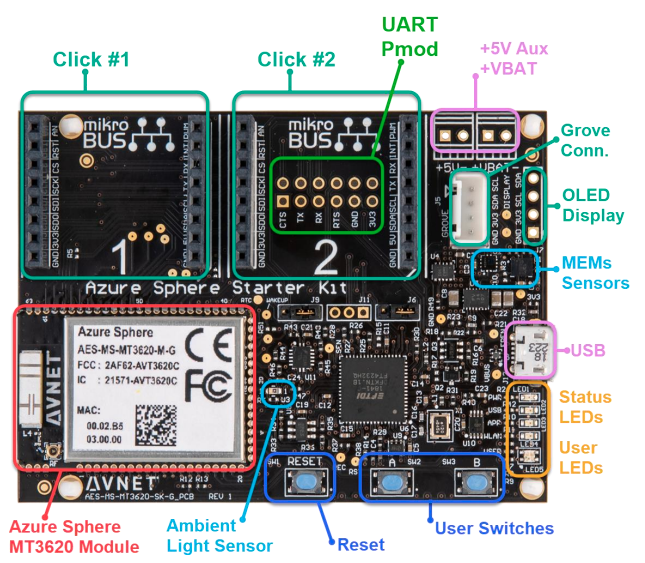

# Healthy Spaces CO2 and Azuze Anomaly Detector API

Create healthier safer workspaces by monitoring CO2, temperature, and humidity levels with [Azure Sphere](https://azure.microsoft.com/services/azure-sphere/?WT.mc_id=julyot-co2-dglover), [Azure IoT Central](https://azure.microsoft.com/en-gb/services/iot-central/?WT.mc_id=julyot-co2-dglover), and [Azure Anomaly Detector](https://docs.microsoft.com/azure/cognitive-services/anomaly-detector/).

---

## What you will learn

You will learn about building secure Edge solutions with Azure Sphere, Azure IoT Central, and you will learn about the Azure Anomaly Detector API service.  The Azure Anomaly Detector service supports univariate and multivariate APIs to monitor data over time and detect anomalies with machine learning. Get insight into your data, regardless of volume, industry, or scenario.

---

## Contents

| Folder | Description |
|-------------|-------------|
| `src`       | Azure Sphere CO2 monitor code |
| `README.md` | This README file. |
| `LICENSE.txt`   | The license for the project. |

## Learning resources

1. [Azure Anomaly Detector API](https://docs.microsoft.com/en-us/azure/cognitive-services/anomaly-detector/)
1. [Azure Sphere Documentation](https://docs.microsoft.com/azure-sphere/)
1. [Develop secure IoT Solutions for Azure Sphere with IoT Hub](https://docs.microsoft.com/learn/modules/develop-secure-iot-solutions-azure-sphere-iot-hub/)
1. [Develop secure IoT solutions for Azure Sphere, Azure RTOS, and Azure IoT Central](https://docs.microsoft.com/learn/modules/develop-secure-iot-solutions-azure-sphere-iot-central/)

---

## Why monitor CO2 levels

The COVID-19 pandemic inspired this project. CO2 levels can impact your productivity and mental health. CO2 levels can also indicate how ventilated an area is. Well ventilated shared spaces will be critical as we return to a "new" normal.

## Create safer spaces

Although CO2 levels are not a direct measure of possible exposure to COVID-19, checking levels using a monitor can help you identify poorly ventilated areas.

Learn more about [Ventilation and air conditioning during the coronavirus (COVID-19) pandemic](https://www.hse.gov.uk/coronavirus/equipment-and-machinery/air-conditioning-and-ventilation/identifying-poorly-ventilated-areas.htm).

## Create productive and healthy spaces

When working from home, it's easy to close the door to shut out the noise of everyday life while we get on with work. Closing the door can lead to a build-up of CO2 gas, a by-product of our breathing. High CO2 levels can impact our wellbeing, concentration, and productivity levels.

Learn how [Indoor carbon dioxide levels could be a health hazard, scientists warn](https://www.theguardian.com/environment/2019/jul/08/indoor-carbon-dioxide-levels-could-be-a-health-hazard-scientists-warn).

The problem is we cannot see or smell Carbon Dioxide, it keeps building up, and we have no way of knowing it's happening other than getting tired or a headache.

---

## Solution requirements

These are the solution requirements:

1. Chart CO2 levels, along with temperature, pressure, and humidity.
1. Provide an audible and visual alert for high CO2 levels.
1. Set CO2 alert levels for a given device.
1. Control when OS and application updates are applied.
1. Automatic restart if the application fails.
1. Access to central error reports for all the devices.
1. IoT Plug and Play support for IoT Central.

## What you will learn from implementing the CO2 monitoring solution

The goal of the solution is also to demonstrate best practices for Azure Sphere solutions. You will learn how to do the following:

1. Set up Azure Sphere security.
1. Publish telemetry to IoT Central.
1. Update "device to cloud" properties for point in time reporting in IoT Central.
1. Update IoT Central "cloud to device" properties to set CO2 "Buzzer" alert levels.
1. Anomaly detection with Azure Anomaly Detector APIs.

> IoT Central is a cloud-based IoT solution built on Azure IoT Hub. IoT Central properties use IoT Hub Device Twins. IoT Central commands use IoT Hub direct methods.

---

## Azure IoT Central

[Azure IoT Central](https://azure.microsoft.com/en-in/services/iot-central/?WT.mc_id=julyot-co2-dglover) provides an easy way to connect, monitor, and manage your Internet of Things (IoT) assets at scale. There is a free trial for IoT Central, and you can continue to connect two devices to IoT Central for free after the trial period expires.

---

## Azure Sphere

Azure Sphere is a general-purpose Edge-to-Cloud platform that is secure by design and by default. You focus on your IoT application, and Azure Sphere looks after ongoing platform security.

Azure Sphere consists of the following components:

* **Azure Sphere–certified chips** from hardware partners include built-in Microsoft security technology to provide connectivity and a dependable hardware root of trust.
* **Azure Sphere OS** adds layers of protection and ongoing security updates to create a trustworthy platform for new IoT experiences.
* **Azure Sphere Security Service** brokers trust for device-to-cloud communication, detects threats, and renews device security.

Together these components implement [The Seven Properties of Highly Secure Devices](https://www.microsoft.com/research/publication/seven-properties-highly-secure-devices?azure-portal=true).

---

## Supported hardware configurations

The CO2 monitor project supports the following hardware configurations.

### Avnet Azure Sphere with Click peripherals

1. [Avnet Azure Sphere Starter Kit Rev 1 or Rev 2](https://www.avnet.com/shop/us/products/avnet-engineering-services/aes-ms-mt3620-sk-g-3074457345636825680/)
1. [MikroE HVAC Click](https://www.mikroe.com/hvac-click)
1. [MikroE BUZZ Click](https://www.mikroe.com/buzz-click)

#### Set up

1. Insert the MikroE BUZZ Click into socket 1 of the Avnet Azure Sphere starter kit.
1. Insert the MikroE HVAC Click into socket 2 of the Avnet Azure Sphere starter kit.

---

### The Sensirion SDC41 CO2 Sensor

The MikroE HVAC Click uses the Sensirion SDC41 CO2, Temperature, and humidity sensor. Calibration of the sensor is also required, see [the SDC4x datasheet](https://cdn.sparkfun.com/assets/d/4/9/a/d/Sensirion_CO2_Sensors_SCD4x_Datasheet.pdf)

### Avnet Azure Sphere onboard sensors

The Avnet Azure Sphere starter kit has several onboard sensors, including temperature, pressure, light, and an accelerometer. This solution uses the onboard air pressure and the light sensor.

So, with the CO2 sensor from Sensirion and the Avnet onboard sensors, there are sensors for carbon dioxide, temperature, humidity, pressure, and light.

## License

See [LICENSE.txt](./LICENSE.txt)

* The AzureSphereDevX repository is included via a submodule. The license for AzureSphereDevX can be [found here](https://github.com/Azure-Sphere-DevX/AzureSphereDevX/blob/master/LICENSE).
* The AzureSphereDevX.HardwareDefinitions repository is included via a submodule. The license for AzureSphereDevX.HardwareDefinitions can be [found here](https://github.com/Azure-Sphere-DevX/AzureSphereDevX.HardwareDefinitions/blob/main/LICENSE).
* The AzureSphereDevX.Tools repository is included via a submodule. The license for AzureSphereDevX.Tools can be [found here](https://github.com/Azure-Sphere-DevX/AzureSphereDevX.Tools/blob/main/LICENSE).
* The AzureSphereDrivers repository is included via a submodule. The license for AzureSphereDrivers can be [found here](https://github.com/Azure-Sphere-DevX/AzureSphereDrivers/blob/master/LICENSE).
